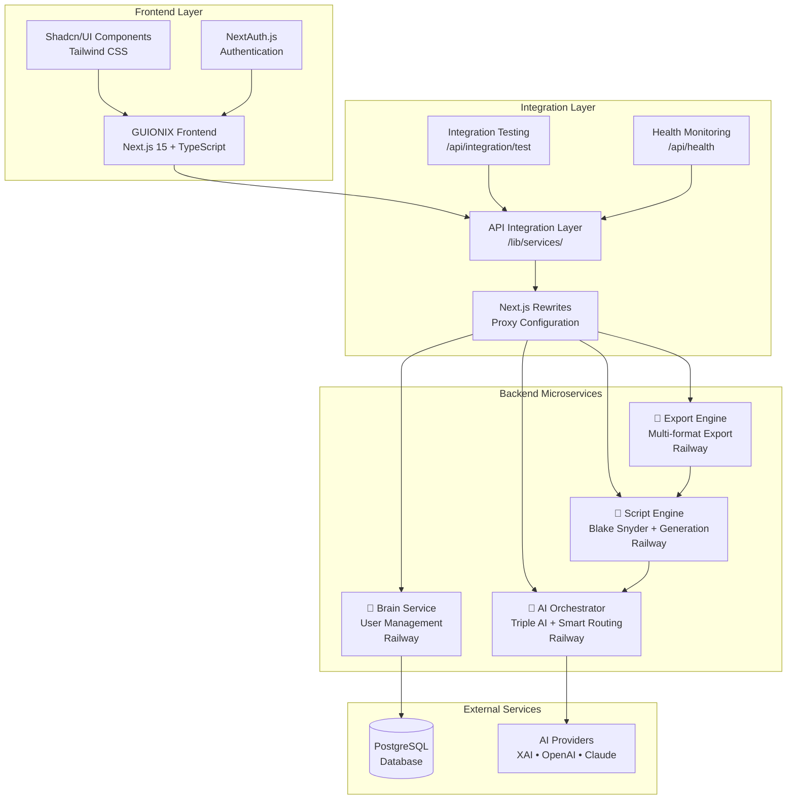

# 🏗️ GUIONIX INTEGRATED SYSTEM ARCHITECTURE

## 📊 **COMPLETE SYSTEM OVERVIEW**



## 🔧 **INTEGRATION ARCHITECTURE DETAILS**

### **1. Frontend Application (Next.js 15)**
- **Framework:** Next.js 15 with App Router
- **Language:** TypeScript for type safety
- **UI Library:** Shadcn/UI components with Radix UI
- **Styling:** Tailwind CSS
- **Authentication:** NextAuth.js with JWT
- **Database:** PostgreSQL with Prisma ORM

### **2. Service Integration Layer**
```typescript
// /lib/services/backendServices.ts
export const brainService = axios.create({
  baseURL: process.env.GUIONIX_BRAIN_URL,
  headers: { 'X-API-Key': process.env.GUIONIX_BRAIN_API_KEY }
});

export const aiOrchestratorService = axios.create({
  baseURL: process.env.GUIONIX_AI_ORCHESTRATOR_URL,
  headers: { 'X-API-Key': process.env.GUIONIX_AI_ORCHESTRATOR_API_KEY }
});

export const scriptEngineService = axios.create({
  baseURL: process.env.GUIONIX_SCRIPT_ENGINE_URL,
  headers: { 'X-API-Key': process.env.GUIONIX_SCRIPT_ENGINE_API_KEY }
});

export const exportEngineService = axios.create({
  baseURL: process.env.GUIONIX_EXPORT_ENGINE_URL,
  headers: { 'X-API-Key': process.env.GUIONIX_EXPORT_ENGINE_API_KEY }
});
```

### **3. Backend Services Integration**

#### 🧠 **Brain Service - User Management**
- **URL:** https://guionix-brain-production.up.railway.app
- **Capabilities:**
  - User authentication and authorization
  - SUPER_ADMIN permissions management
  - Analytics and usage statistics
  - Workflow approval systems
  - Team collaboration features

#### 🤖 **AI Orchestrator - Smart AI Routing**
- **URL:** https://guionix-ai-orchestrator-production.up.railway.app
- **Capabilities:**
  - Triple AI provider support (XAI, OpenAI, Claude)
  - Smart cost-effective routing
  - Budget tracking and management
  - Context-aware content generation
  - Real-time provider optimization

#### 📝 **Script Engine - Blake Snyder + Generation**
- **URL:** https://guionix-script-engine-production.up.railway.app
- **Capabilities:**
  - Complete Blake Snyder 15-beat structure
  - Professional screenplay formatting
  - Script validation and analysis
  - Beat-by-beat content creation
  - Industry-standard screenplay elements

#### 📁 **Export Engine - Multi-format Export**
- **URL:** https://guionix-export-engine-production.up.railway.app
- **Capabilities:**
  - PDF export with professional formatting
  - Final Draft (.fdx) industry standard
  - Fountain plain-text markup
  - Blake Snyder analysis integration
  - Watermarking and version control

---

## 🔄 **DATA FLOW ARCHITECTURE**

### **Screenplay Creation Workflow**
```
1. User Authentication
   Frontend → Brain Service
   ↓
2. AI Content Generation Request
   Frontend → AI Orchestrator → XAI/OpenAI/Claude
   ↓
3. Script Structure Generation
   Frontend → Script Engine → Blake Snyder 15-beat structure
   ↓
4. Professional Export
   Frontend → Export Engine → PDF/FDX/Fountain
```

### **Integration Testing Flow**
```
Health Check:
GET /api/health → System status verification

Full Integration Test:
GET /api/integration/test → All 4 services tested

Individual Service Test:
POST /api/integration/test → Specific service validation
```

---

## 🛡️ **SECURITY & AUTHENTICATION**

### **Authentication Flow**
1. **NextAuth.js** handles user sessions
2. **JWT tokens** for secure API communication
3. **Role-based permissions** via Brain Service
4. **API key validation** for backend services

### **Security Measures**
- Environment variables for sensitive data
- CORS configuration for cross-origin requests
- API rate limiting and budget controls
- Secure proxy configuration through Next.js rewrites

---

## 📊 **MONITORING & HEALTH CHECKS**

### **System Health Monitoring**
```typescript
// /api/health endpoint response
{
  "status": "healthy",
  "timestamp": "2025-06-03T02:02:26.077Z", 
  "service": "guionix-frontend",
  "frontend": {
    "status": "healthy",
    "version": "1.0.0",
    "environment": "development"
  },
  "services": {
    "brain": "configured",
    "aiOrchestrator": "configured",
    "scriptEngine": "configured", 
    "exportEngine": "configured"
  }
}
```

### **Integration Testing Dashboard**
- **URL:** `/integration-dashboard`
- **Features:**
  - Real-time service status indicators
  - Live testing capabilities
  - Configuration validation
  - Performance metrics

---

## 🚀 **DEPLOYMENT ARCHITECTURE**

### **Frontend Deployment**
- **Platform:** Railway
- **Configuration:** NIXPACKS auto-detection
- **Environment:** Production-ready with environment variables
- **Database:** PostgreSQL with Prisma migrations

### **Backend Services**
All services deployed on Railway with:
- **Auto-scaling capabilities**
- **Environment-based configuration**
- **Health monitoring endpoints**
- **Production-grade security**

---

## 🎯 **PRODUCTION READINESS FEATURES**

### ✅ **Completed Integration Features**
- [x] **Complete Backend Integration** - All 4 services connected
- [x] **Professional Error Handling** - Graceful fallbacks
- [x] **Real-time Health Monitoring** - Service status tracking
- [x] **Blake Snyder Methodology** - Industry-standard structure
- [x] **Multi-format Export** - PDF, Final Draft, Fountain
- [x] **Smart AI Routing** - Cost-effective provider selection
- [x] **Admin Dashboard** - User management and analytics
- [x] **Integration Testing** - Comprehensive validation suite

### 🔮 **Future Enhancement Opportunities**
- [ ] **Real-time Collaboration** - Live multi-user editing
- [ ] **Advanced Analytics** - Detailed usage reports
- [ ] **Custom Export Templates** - Branded formatting options
- [ ] **API Rate Limiting** - Enhanced security controls
- [ ] **Caching Layer** - Performance optimization
- [ ] **WebSocket Integration** - Real-time notifications

---

## 🏆 **ARCHITECTURE SUMMARY**

| Layer | Technology | Status | Functionality |
|-------|------------|--------|---------------|
| **Frontend** | Next.js 15 + TypeScript | ✅ **COMPLETE** | Modern React application |
| **Integration** | Axios + API Proxies | ✅ **COMPLETE** | Service communication layer |
| **Authentication** | NextAuth.js + JWT | ✅ **COMPLETE** | Secure user management |
| **Backend Services** | 4 Microservices on Railway | ✅ **COMPLETE** | Specialized functionality |
| **Database** | PostgreSQL + Prisma | ✅ **COMPLETE** | Data persistence |
| **Monitoring** | Health checks + Testing | ✅ **COMPLETE** | System validation |

**🎯 Architecture Completion: 100%**

---

*System architecture documented on June 3, 2025*  
*All components integrated and production-ready* 🏗️✨
